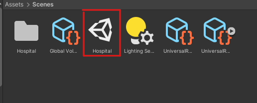
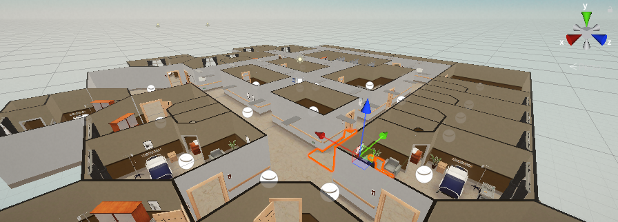

# Setup The Repository
This file explains how to setup the entire repository.

## Contents
- Setup The Repository
  - [1. Requirements](#1-requirements)
  - [2. Repository Setup](#2-repository-setup)
  - [3. Unity Setup](#3-unity-setup)
  - [4. ROS Setup](#4-ros-setup)
  - [5. PicoVoice Setup](#5-picovoice-setup)

## 1. Requirements
This repo was tested on Ubuntu 20.04 with ROS noetic so it requires prior installation of [ROS noetic](http://wiki.ros.org/noetic/Installation/Ubuntu) and [Unity Hub](https://unity.com/download).

## 2. Repository Setup
In-order to setup the repository locally on your system, open a new terminal and follow the instructions below

    mkdir catkin_ws
    cd catkin_ws
    git clone https://github.com/dennyboby/social_robot_navigation.git

## 3. Unity Setup
To setup Unity open Unity Hub and follow the instructions below:
1. Go to the `Installs` tab in Unity Hub, and click the `Add` button. Select Unity `2021.1.17f1`. If this version is no longer available through the hub, you can find it in the Unity Download Archive.
2. Go to the `Projects` tab in the Unity Hub, click the `Add` button, and navigate to and select the `Gopher-In-Unity-Simulation` directory within this cloned repository `(/PATH/TO/catkin_ws/social_robot_navigation/Unity/Projects/Gopher-In-Unity-Simulation)` to add the project to your Hub.
3. Click the newly added project to open it.
4. After launching the project, please navigate to the `Scenes` folder and open the `Hospital` scene.

    

    

5. You can toggle the visibility of the ceiling in the game object hierarchy.

    

6. Next, the ROS TCP connection needs to be created. Select `Robotics -> ROS Settings` from the top menu bar. In the ROS Settings window, the ROS IP Address should be the IP address of your ROS machine (not the one running Unity). Find the IP address of your ROS machine. In Ubuntu, open a terminal window, and enter `hostname -I`.

    

7. Finally the simulation will look like the image shown below.

    

## 4. ROS Setup
To setup the ROS part of the repository open a new terminal and follow the instructions below.

    cd catkin_ws/social_robot_navigation/ROS
    sudo apt-get install ros-noetic-catkin python3-catkin-tools
    catkin init
    catkin build
    source devel/setup.bash

Make sure that every new terminal running ROS components is sourced to avoid unable to find package issue.
In order to symlink python to the python3 version, open a new terminal and follow the instructions below ([link](https://packages.debian.org/sid/main/python-is-python3)).

    sudo apt install python-is-python3

Install the libraries required for the ROS part of the repository.

    cd ..
    pip install -r requirements.txt

## 5. PicoVoice Setup
To setup PicoVoice, go to [picovoice.ai](https://picovoice.ai/), go to [console](https://picovoice.ai/console/)  and create an account. We have already placed our intent detection model, so you do not need to create a new model unless you wish to.

1. First step is to create `AccessKey` which can be done from the `AccessKey` tab. This Access Key is important when you integrate PicoVoice with ROS.

    

2. Now, replace this new Access Key in the `social_robot_navigation/ROS/src/Freight-ROS-Unity/freight_intent_recognition/config/params.yaml` file. Now you are all set, you can now try running the simulation and python scripts by following the other steps in the README.md

    

If you wish to build your own model for your specific problem, you can refer point 1, then 3 to 7. 

3. Next go to the Rhino Console by clicking on the Rhino Tab. Here you can see various pre-defined templates, but we will work with an Empty Template. You can name the template as you wish but we will name it `Navigation` for our purpose. Open the Navigation Context by clicking on the name `Navigation`. You can refer the Rhino syntax [cheatsheet](https://picovoice.ai/docs/tips/syntax-cheat-sheet/) when you wish to create your own model. You can also refer to the [link](https://github.com/Picovoice) for queries and other information.

4. Click on Import YAML which is at the bottom, and import the YAML file from `docs > model` in github and then try it out by clicking on the Microphone button at the top.
(If importing fails, you must develop the model again from scratch but fret not, you can refer the YAML file, quick start guide and [cheatsheet](https://picovoice.ai/docs/tips/syntax-cheat-sheet/)).

    

5.  Download the model that you made and place it in the `social_robot_navigation/ROS/src/Freight-ROS-Unity/freight_intent_recognition/config` path, and make changes to the `Access Key` in the script.

    

6. Now you are all set, you can now try running the simulation and python scripts.

7. You can build upon our model by making suitable changes and then exporting the model by clicking on the `Model` option present on the left and click on `Train` button on the right, you can see that there are various platforms like Linux, Raspberry Pi etc that you can create your model for.

